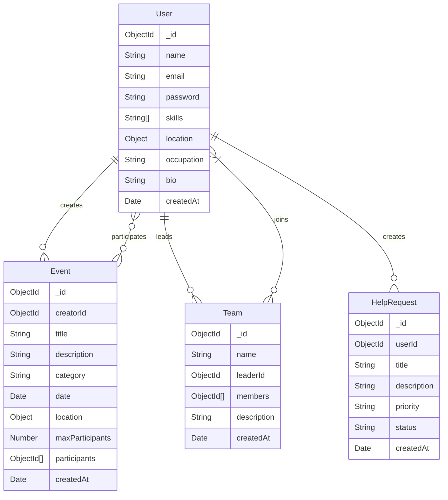

# 🌟 Hands ON

<div align="center">

[](https://reactjs.org/)
[](https://www.mongodb.com/)
[](https://nodejs.org/)
[](https://mui.com/)
[](https://github.com/shRamim13/volunteer-connect)

</div>

## 📋 Project Overview

Volunteer Connect is a comprehensive platform that bridges the gap between volunteers and community service opportunities. It enables users to:

- Create and manage volunteer events
- Join community service activities
- Track volunteer events and impact
- Form teams for collaborative projects
- Request and offer help within the community

The platform features a modern, responsive interface with real-time updates and secure authentication.

## 🛠️ Technologies Used

### Frontend Stack

- **React 18** - Component-based UI development
- **Material-UI v5** - Modern UI components and styling
- **React Router v6** - Client-side routing
- **Context API** - State management
- **Axios** - HTTP client
- **Framer Motion** - Animations
- **Socket.io-client** - Real-time updates

### Backend Stack

- **Node.js** - Runtime environment
- **Express.js** - Web framework
- **MongoDB** - NoSQL database
- **Mongoose** - ODM for MongoDB
- **JWT** - Authentication
- **Socket.io** - Real-time server
- **Multer** - File uploads
- **bcrypt** - Password hashing

### Development & Deployment

- **Git** - Version control
- **ESLint** - Code linting
- **Jest** - Testing
- **MongoDB Atlas** - Cloud database
- **Vercel** - Deployment platform

## ✨ Key Features

### User Management

- Multi-step registration process
- JWT-based authentication
- Profile customization
- Skills management
- Activity tracking

### Event System

- Event creation and management
- Category-based filtering
- Search functionality
- Real-time updates
- Participant management

### Community Features

- Team creation and management
- Help request system
- Impact tracking

## 📊 Database Schema



## 🚀 Setup Instructions

### Prerequisites

```bash
node >= 14.0.0
npm >= 6.14.0
mongodb >= 4.4.0
```

### Environment Configuration

1. Clone the repository

```bash
git clone https://github.com/shRamim13/volunteer-connect.git
cd volunteer-connect
```

2. Create environment files

Backend `.env`:

```env
MONGODB_URI=your_mongodb_uri
JWT_SECRET=your_jwt_secret
PORT=5000
NODE_ENV=development
CORS_ORIGIN=http://localhost:3000
```

Frontend `.env`:

```env
REACT_APP_API_URL=http://localhost:5000
REACT_APP_SOCKET_URL=ws://localhost:5000
REACT_APP_GOOGLE_MAPS_KEY=your_google_maps_key
```

### Installation

1. Install backend dependencies:

```bash
cd backend
npm install
```

2. Install frontend dependencies:

```bash
cd frontend
npm install
```

## 📡 API Documentation

### Authentication Endpoints

\`\`\`http
POST /api/auth/register
Content-Type: application/json

{
"name": "string",
"email": "string",
"password": "string"
}

Response: 200 OK
{
"token": "jwt_token",
"user": {
"id": "string",
"name": "string",
"email": "string"
}
}
\`\`\`

\`\`\`http
POST /api/auth/login
Content-Type: application/json

{
"email": "string",
"password": "string"
}

Response: 200 OK
{
"token": "jwt_token",
"user": {
"id": "string",
"name": "string",
"email": "string"
}
}
\`\`\`

### Event Endpoints

\`\`\`http
GET /api/events
Authorization: Bearer {token}

Response: 200 OK
{
"events": [
{
"id": "string",
"title": "string",
"description": "string",
"date": "string",
"location": "object",
"category": "string",
"participants": ["string"]
}
]
}
\`\`\`

\`\`\`http
POST /api/events
Authorization: Bearer {token}
Content-Type: application/json

{
"title": "string",
"description": "string",
"date": "string",
"location": "object",
"category": "string",
"maxParticipants": "number"
}

Response: 201 Created
{
"id": "string",
"title": "string",
"description": "string"
}
\`\`\`

### Profile Endpoints

\`\`\`http
GET /api/profile
Authorization: Bearer {token}

Response: 200 OK
{
"user": {
"id": "string",
"name": "string",
"email": "string",
"skills": ["string"],
"bio": "string",
"location": "string"
}
}
\`\`\`

## 🖥️ Running the Project

### Development Mode

1. Start the backend server:

```bash
cd backend
npm run dev
```

2. Start the frontend development server:

```bash
cd frontend
npm start
```

The application will be available at:

- Frontend: http://localhost:3000
- Backend API: http://localhost:5000

### Production Mode

1. Build the frontend:

```bash
cd frontend
npm run build
```

2. Start the production server:

```bash
cd backend
npm start
```

### Docker Deployment

1. Build the images:

```bash
docker-compose build
```

2. Run the containers:

```bash
docker-compose up -d
```

## 👥 Developer

<div align="center">
  <a href="https://github.com/shRamim13">
    
    <br />
    <sub><b>Ramim</b></sub>
  </a>
</div>

## 📞 Support

<div align="center">

[](https://www.linkedin.com/in/sabbir-hossen-ramim-263a101a6/)
[](https://github.com/shRamim13)
[](mailto:shramim13@gmail.com)

</div>

---

<div align="center">

Made with ❤️ by [Ramim](https://github.com/shRamim13)

</div>
